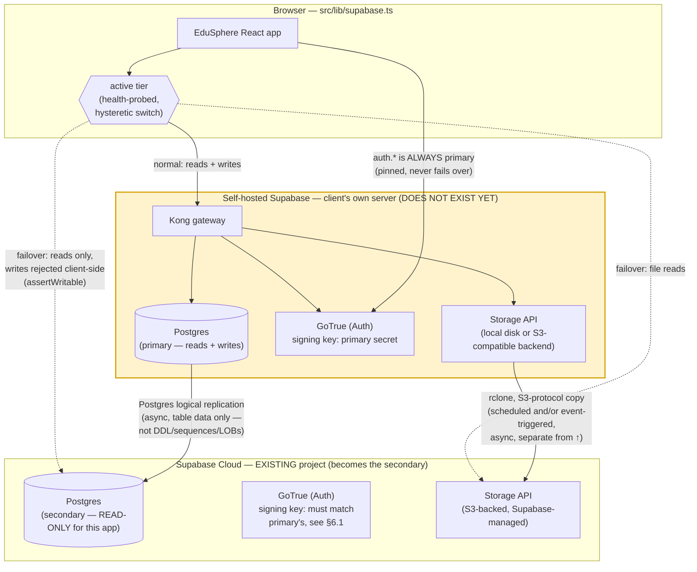

# EduSphere V2 — Two-Tier Database / Storage High Availability

Status: **design + client wiring done; infrastructure not stood up yet.** The self-hosted
primary does not exist today. Nothing below that requires the self-hosted server has been
verified against a real instance — it is verified against Supabase's current published
documentation and Postgres's documented logical-replication mechanics, not against this
system running. Treat every claim tagged `[UNVERIFIED]` below as exactly that until someone
runs the spike described next to it.

**Read this first if you only read one section: [§6 Risks](#6-risks--read-this-section-first-in-spirit),
especially [§6.1 JWT/session recognition across stacks](#61-jwts-do-not-transfer-across-stacks-by-default---this-is-the-load-bearing-gap).**
The short version: this plan is real and buildable, but "students keep browsing during a
primary outage" is **not true out of the box** — it requires a specific one-time key-sharing
step this document specifies, and even then only covers *already signed-in* users reading
*already-replicated* data. New sign-ins never work during an outage, by design.

---

## 1. Topology



**Roles, plainly:**

| | Primary (self-hosted) | Secondary (Supabase Cloud — the existing project) |
|---|---|---|
| Exists today? | No — this is new infrastructure to be provisioned | Yes — already running the app in production |
| Writes | Yes, always the only writer | Never, by policy (app-enforced, see §6.2) |
| Reads | Yes, normal path | Only during failover |
| Auth (sign-in/up/refresh) | Yes, always — even during failover attempts by users who aren't yet signed in | Never |
| Gets new schema migrations first | Either order is fine once both are stood up, but pick one and be consistent (recommend: primary first, then secondary, since primary is now the source of truth) | |

This is a **CP-leaning** choice per the CAP/PACELC tradeoff (`fundamentals.md` §6): under a
partition (primary unreachable), the app gives up availability-for-writes rather than risk two
databases independently accepting writes and diverging with no correct merge. That's the
explicit, already-settled design goal, and it's the right call — the alternative (dual-write) is
a named anti-pattern (`anti-patterns.md` #7, "dual-write / missing outbox") precisely because two
independent writers with no shared transaction coordinator will eventually diverge in a way
nothing can automatically reconcile. Do not revisit this.

---

## 2. Standing up self-hosted Supabase

Self-hosted Supabase is **not** "the same product with different infrastructure." Supabase's
own docs are explicit about this (verified live against `supabase.com/docs/guides/self-hosting`):

> "Self-hosted Supabase mimics a single project... Platform-only features such as branching,
> advanced metrics beyond logs, **managed backups and PITR**, analytics and vector buckets, ETL,
> and the platform management API are unavailable in self-hosted configuration."
>
> "When you self-host, you are responsible for: server provisioning and maintenance; security
> hardening...; Postgres database maintenance; **high availability and scalability**; **backups
> and disaster recovery**; monitoring and uptime."

Read that as it's written: standing up self-hosted Supabase does not give you a second managed
database. It gives you a Docker Compose stack (Postgres + GoTrue + PostgREST + Storage API +
Kong + Realtime + Studio) that the client's own team now operates, including its backups. See
§6.3 for what this means concretely.

### 2.1 Sequence

1. **Provision the server.** Docker + Docker Compose, per `supabase/supabase` repo's
   `docker/` directory (the officially recommended path — Kubernetes/Helm and Traefik variants
   exist but are community-supported, not first-party). Put it behind TLS (a reverse proxy —
   Supabase's own guide has an "Add Reverse Proxy with HTTPS" how-to) — logical replication and
   every API call to this box will cross the public internet to reach Supabase Cloud, so this is
   not optional. `[UNVERIFIED]`: exact hardware sizing — no load numbers exist yet for this app
   on this infrastructure; start with whatever the current Cloud project's compute tier implies
   as a floor, not a guess.
2. **Seed it from the existing Cloud project**, since Cloud already holds the real production
   data and this app is going into production on day one, not starting from empty. Use
   `pg_dump`/`pg_restore` (Supabase's own "Migrate from Postgres to Supabase" dump/restore
   method, run in reverse — Cloud is the source here, self-hosted is the target) to copy schema
   + data once, offline, before any replication is configured. Roles and RLS-enabled status are
   **not** carried by dump/restore per Supabase's own migration guide — re-run migrations
   `001`–`011` (this repo's `supabase/migrations/`) against the fresh self-hosted instance
   instead of/in addition to the dump, so the RLS policies, `is_admin()`/`is_owner()`/
   `is_verified_student()` helper functions, triggers, and grants exist identically. This
   is the point at which schema drift is easiest to introduce — do it via the versioned
   migration files, not by hand.
3. **Check extension parity.** This schema's own migrations declare no `CREATE EXTENSION`
   statements (verified: `grep -rn "CREATE EXTENSION" supabase/migrations/` returns nothing) and
   use `gen_random_uuid()` exclusively for primary keys (no `SERIAL`/`IDENTITY`/`nextval` found
   anywhere in the migrations) — `gen_random_uuid()` has been a Postgres-core built-in since
   PG13, so this specific schema has low extension-parity risk. That's a property of *this*
   schema today, not a guarantee for whatever gets added next — self-hosted Postgres lets you
   `CREATE EXTENSION` anything in the community-extension universe; Supabase Cloud only exposes
   a curated allowlist (`SELECT name FROM pg_available_extensions` on Cloud shows the ceiling).
   Any future migration that reaches for an extension needs to check that list before it's
   written, not after it fails to apply to Cloud.
4. **Point `VITE_SUPABASE_URL`/`VITE_SUPABASE_ANON_KEY` at the self-hosted instance**, and move
   the current values (the existing Cloud project) into
   `VITE_SUPABASE_FALLBACK_URL`/`VITE_SUPABASE_FALLBACK_ANON_KEY`. This is the only application
   change needed at cutover — `src/lib/supabase.ts` is already built for this (see §7).
5. **Deploy Edge Functions to the new primary.** `exam-download`, `student-otp`,
   `university-sync` (`supabase/functions/`) currently run on Cloud. Self-hosted Supabase
   supports Edge Functions ("Run Self-Hosted Functions" in its docs) but they are not
   auto-deployed by seeding the database — deploy them explicitly to the new primary. They stay
   deployed on Cloud too (already there); §7's client routes `.functions.invoke()` to whichever
   tier is active, so both copies need to exist and stay in sync, or failover-time invokes of
   these three functions will 404 against the tier that's missing them.

### 2.2 Postgres logical replication — primary → Cloud secondary

This is the part with real, documented mechanics, verified live against Supabase's own
"Migrate from Postgres to Supabase" guide's **Method 3: Logical replication**
(`supabase.com/docs/guides/platform/migrating-to-supabase/postgres`). That guide frames this as
a one-time migration/cutover tool ("drop the subscription once you've cut over"). **We are
repurposing the exact same mechanism for a standing, indefinite replication channel instead of
a one-time cutover — Supabase does not document this specific ongoing-HA usage pattern.** The
underlying Postgres mechanism is sound either way; the "run this forever, not once" usage is
`[UNVERIFIED]` at the product-support level, not at the protocol level. Confirm with Supabase
support before depending on it in production (their self-hosting docs list a Growth/Enterprise
contact for exactly this kind of question) — do not assume a long-lived external subscription
is something Supabase Cloud's own maintenance operations (upgrades, failovers on their side,
storage reclamation) are guaranteed not to disrupt.

**Prerequisites on the source (self-hosted primary):**

```conf
# postgresql.conf
wal_level = logical
max_replication_slots = 10
max_wal_senders = 10
max_connections = 200   # existing connections + headroom for the subscription

# pg_hba.conf — allow Supabase Cloud's connection in (over TLS)
hostssl replication all <supabase-egress-range>  md5
hostssl all         all <supabase-egress-range>  md5
```

This means **the self-hosted primary's Postgres port must accept inbound connections from the
public internet** (specifically, from wherever Supabase Cloud's subscriber process connects
from) over TLS with a replication-privileged role. That is a real, standing security-exposure
decision, not a footnote — see §6.6.

**Every table that will replicate needs a replica identity** — a primary key satisfies this
automatically. Check before enabling replication:

```sql
SELECT n.nspname, c.relname
FROM pg_class c
JOIN pg_namespace n ON n.oid = c.relnamespace
LEFT JOIN pg_constraint pk ON pk.conrelid = c.oid AND pk.contype = 'p'
WHERE c.relkind = 'r' AND pk.oid IS NULL
  AND n.nspname NOT IN ('pg_catalog', 'information_schema');
```

Given every table in this schema uses `UUID PRIMARY KEY DEFAULT gen_random_uuid()`, this should
return no rows for the app's own tables — confirm it actually does before relying on it.

**Create the publication on the self-hosted primary** — deliberately scoped, not `FOR ALL
TABLES`:

```sql
CREATE PUBLICATION edusphere_primary_pub
  FOR TABLE
    public.profiles, public.courses, public.previous_exams, public.entrance_exams,
    public.course_materials, public.print_documents,
    public.exam_reports, public.exam_download_events, public.schedule_entries
    -- ...every application table under public that the fallback should be able to
    -- serve reads from. Enumerate explicitly; do not use FOR ALL TABLES.
  WITH (publish = 'insert, update, delete');
```

**Deliberately excluded: the `storage` and `auth` schemas.** This is the single easiest mistake
to make here, so it's worth stating twice:

- **`storage.objects`/`storage.buckets` must NOT be in this publication.** Supabase's own "Copy
  Storage Objects from Platform" guide is explicit that copying files via the S3 protocol is
  what creates the correct `storage.objects` metadata row on the destination — if Postgres
  logical replication is *also* writing to that same table from the primary side, you have two
  independent writers racing on `storage.objects`, which is exactly the single-writer violation
  (`decision-rules.md` RULE 3.7) this whole design is trying to avoid, just relocated to the
  storage-metadata layer. Storage gets its own mirroring mechanism (§3); bucket definitions
  travel via the versioned SQL migrations (they already do — `storage.buckets` rows are created
  by `INSERT`s in migrations `001`, `008`, `009`), not via this publication.
- **`auth.users` is a judgment call, not a default-yes.** Including it *does* propagate account
  data (email, hashed password, `app_metadata`/`user_metadata`) to the secondary, which is a
  precondition for RLS decisions on the fallback to match primary's for a given user. But it
  also means the fallback accumulates a live copy of credential data outside Supabase's own
  Auth-service replication guarantees, on a schema Supabase does not document replicating this
  way. If included, it needs the same lag-awareness as every other table (§6.4) and should be
  treated as sensitive data requiring the same access controls on the secondary it has on the
  primary.

**Create the subscription on Supabase Cloud** (the secondary) — connect using the **Supavisor
session pooler** connection string (Supabase's explicit recommendation for migration/replication
tasks, not the transaction pooler or a random direct connection):

```sql
-- Run against the Cloud project (e.g. via the SQL Editor, or psql against the
-- session-pooler connection string from Project → Connect):
CREATE SUBSCRIPTION edusphere_failover_sub
  CONNECTION 'host=<self-hosted-host> port=5432 user=replicator password=<pw> dbname=postgres sslmode=require'
  PUBLICATION edusphere_primary_pub
  WITH (copy_data = true, create_slot = true);
```

`CREATE SUBSCRIPTION` on Supabase Cloud **is confirmed working** — this is not a guess. Verified
live against Supabase's own docs, which show this exact command run against a Cloud project as
the documented Postgres-migration path. Supabase Cloud's `postgres` role is not a true
superuser (`supabase.com/docs/guides/database/postgres/roles-superuser`, verified: the only
explicitly unsupported operations listed are `COPY ... FROM PROGRAM` and
`ALTER USER ... WITH SUPERUSER`), and `CREATE SUBSCRIPTION` is not on that list.

**What does NOT replicate — verified directly from Supabase's guide, not general Postgres
folklore:**

| Not replicated | Consequence for this app | Mitigation |
|---|---|---|
| **DDL (schema changes)** | Every future migration (`012_...sql` and on) must be applied to *both* databases separately — logical replication will not carry a `CREATE TABLE`/`ALTER TABLE` across. This is a standing process cost for the life of this architecture, not a one-time setup step. | Apply migrations to primary, verify, then apply the identical file to the Cloud secondary before or immediately after. A migration applied to only one side silently breaks replication the moment a replicated table's shape diverges. |
| **Sequences** | Low impact for *this* schema specifically — confirmed no `SERIAL`/`IDENTITY`/`nextval` usage anywhere in `supabase/migrations/`. Any future table that does use a sequence would need manual periodic sync (`setval` on the subscriber) or it will silently diverge. | Keep using UUID PKs; if a sequence is ever introduced, treat its sync as a required runbook item, not an afterthought. |
| **Large Objects (`pg_largeobject`/`lo_*`)** | Not applicable — this app stores files via Supabase Storage (separate mechanism, §3), never Postgres large objects. | None needed. |

**RLS policies, roles, and helper functions must exist identically on both sides.** They are
schema objects (functions, policies, grants), which means they arrive via the same migration
files as everything else in the `if (DDL not replicated)` row above — logical replication does
not create them, migrations do. `anon`/`authenticated`/`service_role` Postgres roles must exist
with matching privileges on both databases for a given JWT's `role` claim to produce the same
authorization decision on either side — see §6.1 for why the JWT itself is the harder half of
this problem.

### 2.3 Verifying replication is actually healthy

```sql
-- On the Cloud secondary (subscriber side):
SELECT * FROM pg_stat_subscription;
SELECT srsubstate, count(*) FROM pg_subscription_rel GROUP BY srsubstate;
-- srsubstate: 'r' = ready/synced, 'i' = initializing, 'd' = data copy in progress

-- On the self-hosted primary (publisher side):
SELECT slot_name,
       pg_size_pretty(pg_wal_lsn_diff(pg_current_wal_lsn(), restart_lsn)) AS lag_size
FROM pg_replication_slots;
SELECT * FROM pg_stat_replication;
```

`lag_size` growing over time (not just nonzero — Postgres logical replication is asynchronous by
design, so some nonzero lag is normal and expected) is the signal to alert on, not a fixed
threshold pulled from nowhere. **No real number exists yet for what "normal" lag looks like for
this app on this infrastructure** — that can only be measured once the primary exists and carries
real traffic. Treat any specific lag SLO stated before that measurement as a placeholder.

---

## 3. Storage bucket mirroring

Files never touch Postgres logical replication (see §2.2's explicit exclusion). Both self-hosted
Supabase Storage and Supabase Cloud Storage expose an **S3-compatible protocol endpoint**
(`/storage/v1/s3`) — verified live against `supabase.com/docs/guides/storage/s3/compatibility`
and the self-hosting "Configure S3 Storage" guide. Supabase's own "Copy Storage Objects from
Platform" guide documents exactly this S3-to-S3 copy pattern using `rclone`, framed as a
one-time migration; the same mechanism works unchanged as an ongoing, repeated sync — just
run it on a schedule instead of once, and point it in the opposite direction (self-hosted is the
source now, Cloud is the destination).

**Why not raw filesystem copy:** Supabase's own docs are explicit that "direct file copy... does
not work. Self-hosted Storage uses an internal file structure that differs from what you get
from the platform. Use the S3 protocol... so Storage creates the correct metadata records." A
Storage object is a *pair* — a file plus a `storage.objects` row — and only the S3-protocol
upload path keeps both in sync on the receiving side.

### 3.1 Recommended setup

1. Enable the S3 protocol endpoint on self-hosted Storage (`S3_PROTOCOL_ACCESS_KEY_ID`/
   `S3_PROTOCOL_ACCESS_KEY_SECRET` in the self-hosted `.env`).
2. Generate S3 credentials for the Cloud project (Storage → S3 Configuration → Access keys).
3. Pre-create matching buckets on both sides with matching `public`/private settings — already
   true here, since bucket rows come from the versioned migrations (§2.2).
4. Configure `rclone` with both remotes and run, on a schedule (cron / systemd timer):
   ```bash
   rclone sync self-hosted:exam-papers        platform:exam-papers        --progress
   rclone sync self-hosted:course-materials   platform:course-materials   --progress
   rclone sync self-hosted:avatars            platform:avatars            --progress
   rclone sync self-hosted:print-documents    platform:print-documents    --progress
   ```
   Use `sync` (mirrors deletions too), not `copy`, if deleted materials/print documents should
   also disappear from the fallback — confirm that's the desired retention behavior first (a
   `sync` that mirrors a deletion is itself an async operation with its own lag; a wrongly-timed
   delete-then-failover could make a file briefly inaccessible on the fallback even though it
   still exists on primary, or vice versa).

### 3.2 Tradeoff: batch interval vs. lower-lag alternatives

| Approach | Mechanism | Typical lag | Added complexity |
|---|---|---|---|
| **Scheduled `rclone sync`** (recommended default) | Cron/systemd timer, e.g. every 5–15 min | Up to the interval length | Low — one script, one schedule |
| **Event-triggered** | A trigger/webhook on `storage.objects` INSERT (self-hosted side) invokes a worker that immediately S3-copies that one object | Seconds, typically | Higher — a new always-on worker, its own retry/idempotency and dead-letter handling for objects whose trigger-time copy fails |
| **Synchronous best-effort dual-upload** *(optional, requires changing service code — out of this file's scope)* | The upload service (`materials.ts`, `portal.ts`, `profile.ts`, `admin.ts` — none of which I touched) uploads to primary, then makes a best-effort synchronous upload to the Cloud bucket too, logging (not blocking) on failure | Near-zero for the success path | Touches multiple service files; does **not** reintroduce the dual-write anti-pattern in the database sense, because this app's upload paths mint a fresh unique object path per upload rather than overwriting an existing one — there is no write-write conflict to resolve, only a "did the second copy succeed" question |

Whichever is chosen, **run a periodic reconciliation pass regardless** (`rclone check` or a
`sync` with `--dry-run` first) as the backstop for anything the primary mechanism missed — a
webhook that silently failed once, a cron job that didn't run one night, etc. Recommend the
download UI treat "signed URL creation succeeded on the fallback but the object isn't actually
there yet" as an expected, handleable state (clear message, not a broken image) rather than an
unhandled 404 — that's UI-layer work belonging to whoever owns the download components, not this
file.

---

## 4. Failover / failback runbook

**Detection (automatic, client-side):** `src/lib/supabase.ts` probes both tiers' PostgREST root
route (`GET {url}/rest/v1/`, authenticated with that tier's own anon key) every 30s. Two
consecutive failed primary probes → failover. Two consecutive successful primary probes while on
fallback → automatic failback. See §7 for the exact mechanism and why those thresholds exist.

**What degrades during failover, precisely:**

| Capability | During failover | Why |
|---|---|---|
| Browsing public catalog data (courses, public exam listings) | Should work | Read-only queries the fallback's `anon`/`authenticated` role can serve without needing a per-user RLS check |
| Browsing anything gated by `is_verified_student()`/per-user RLS | **`[UNVERIFIED]` — depends entirely on §6.1** | These RLS checks resolve `auth.uid()` from the JWT; whether the fallback accepts primary's JWT is the open question in §6.1 |
| File downloads (signed URLs) | Works for files that have finished mirroring (§3); 404/error for files uploaded since the last successful mirror pass | Storage mirroring lag |
| New sign-in / sign-up | **Never works** — by design | Auth is pinned to primary always (§7); this is intentional, matching Supabase's own Read Replica architecture |
| Submissions, ratings, uploads, `university-sync` invoke | Blocked | `assertWritable()` (opt-in, see §6.2 for the enforcement gap) / recommended DB-level REVOKE on the fallback |
| Session persistence for already-signed-in users | Client-side session object persists (it's just in `localStorage`/memory); whether it's still *useful* against the fallback is the §6.1 question | supabase-js doesn't clear a session just because a query 401s |

**Operator checklist when failover is observed (via monitoring/alerting on the console.error the
client already emits, or a dashboard built on `getConnectionState()`):**

1. Confirm it's real: check the self-hosted primary directly (server reachable? Postgres up?
   Kong/PostgREST up?) — don't assume the client's health probe is the only signal.
2. Check replication lag on the Cloud secondary (§2.3's queries) **before trusting what students
   are seeing** — if lag was already large before the outage, failover just made a stale view
   visible, it didn't create the staleness.
3. Check Storage mirror freshness (last successful `rclone sync`/reconciliation run timestamp).
4. If the outage is expected to be long, communicate it — the banner (§7) shows read-only state,
   but doesn't explain *why* or *for how long*; that's a judgment call for a human, not something
   to automate.
5. Do **not** manually re-enable writes against the fallback under any circumstance. Supabase's
   own migration guide states this as plainly as it can be stated, in the context of the exact
   same replication mechanism this document uses: *"Do NOT re-enable writes to avoid a
   split-brain scenario!"*

**Recovery / failback:**

1. Primary comes back up. The client's health probe detects two consecutive successful checks
   and fails back automatically — no manual client-side action needed.
2. Before trusting primary again as fully caught up: if primary was down long enough that its
   own state might be suspect (e.g., it crashed rather than a network blip), verify Postgres
   started cleanly and isn't in recovery/crash-recovery mode, and reconcile Storage in the
   primary→secondary direction as normal (the mirror direction never changes — secondary is
   never a source of truth to copy back from, consistent with §1's role table).
3. Confirm the replication subscription on the secondary is still `active` and resumed cleanly
   (`SELECT * FROM pg_stat_subscription;` — a `latest_end_lsn` that's advancing again). A
   subscription can end up needing manual intervention (`ALTER SUBSCRIPTION ... ENABLE`, or
   recreating it if the replication slot was dropped during the outage) — this is exactly the
   kind of thing §2.2's "not an officially supported ongoing-use pattern" caveat is about; don't
   assume it self-heals without checking.

---

## 5. What the client actually does (`src/lib/supabase.ts`)

Summary — full detail and rationale is in the file's own doc comments, which are extensive on
purpose since this file is imported by nearly every service in the app:

- **No fallback vars set (today's shipping state):** `supabase` is exactly `createClient(...)`,
  same as before this change — no Proxy, no timers, no extra network calls. Verified: `npx tsc -b
  --force` exit 0, `npx vitest run` 57/57, `npm run build` exit 0 with the `vendor-supabase`
  bundle chunk unchanged (same content hash as the pre-change baseline), and the running dev
  server at `localhost:5173` (with `.env.local` containing only the primary vars) serves and
  transforms `main.tsx`/`AuthContext.tsx`/`supabase.ts` all at HTTP 200 with `.env` injection
  showing no fallback keys present — the exact "no fallback configured" code path.
- **Both fallback vars set:** `supabase` becomes a `Proxy` forwarding every call
  (`.from()`, `.rpc()`, `.storage`, `.functions`) to whichever tier is currently active, with
  methods correctly re-bound to the real client instance (a bare `Reflect.get` forward would
  break at the first method call — supabase-js's classes rely on internal/private state a raw
  Proxy object doesn't have; see the file's comment on `createTierAwareClient`). `.auth` is
  special-cased to always resolve to the primary client's auth.
- **Health probing:** `GET {url}/rest/v1/` with that tier's own anon key, every 30s, 5s timeout,
  paused while the tab is hidden. 2 consecutive failures to flip away from primary, 2 consecutive
  successes to flip back — tunable via `FAILOVER_THRESHOLD`/`FAILBACK_THRESHOLD`, both exported
  and both explicitly marked `[UNVERIFIED]` starting heuristics in the source, not measured
  against this app's real failure behavior (none exists yet to measure).
- **Observable state:** `getConnectionState()` / `subscribeConnectionState(cb)` — the latter
  takes a no-arg callback specifically so it drops straight into
  `useSyncExternalStore(subscribeConnectionState, getConnectionState)` with no adapter.
- **Write guard:** `assertWritable(actionLabel?)` throws `ReadOnlyModeError` (with a stable
  `.code === "READ_ONLY_MODE"`) when `tier === "fallback"`. **This is opt-in** — see §6.2 for
  exactly what that does and doesn't guarantee.

### 5.1 Banner component contract (for whichever agent owns the UI — not wired by this change)

```tsx
import { useSyncExternalStore } from "react";
import {
  getConnectionState,
  subscribeConnectionState,
  type ConnectionState,
} from "@/lib/supabase";

interface ReadOnlyBannerProps {
  /** Optional override for tests/storybook. Omit in real usage — the
   *  component subscribes to the live client state itself. */
  state?: ConnectionState;
  className?: string;
}

export function ReadOnlyBanner({ state, className }: ReadOnlyBannerProps) {
  const live = useSyncExternalStore(subscribeConnectionState, getConnectionState);
  const s = state ?? live;
  if (!s.readOnly) return null;

  return (
    <div role="status" aria-live="polite" className={className}>
      <p>
        You&rsquo;re viewing cached data while our main server is unreachable. Submissions,
        uploads, ratings, and reports are temporarily disabled.
      </p>
      <p lang="fr">
        Vous consultez des données en cache pendant que notre serveur principal est
        injoignable. Les envois, téléversements, évaluations et signalements sont
        temporairement désactivés.
      </p>
    </div>
  );
}
```

**Recommended mounting point:** once, near the root layout (e.g. in `App.tsx`, above the router
outlet) — zero props required for real usage, applies globally without per-page wiring. No
styling/positioning opinion is imposed (`className` is the only styling hook) since that's a
UI-ownership decision.

**For services that write:** call `assertWritable("submit exam report")` (or similar,
human-readable action label) as the first line of any mutating function, and let
`ReadOnlyModeError` propagate to whatever the existing error-handling path is
(`getSafeErrorMessage`/`formatErrorResponse` in `src/lib/errors.ts` will pass its `.message`
through unchanged, since it matches none of that function's redaction patterns — or catch
`instanceof ReadOnlyModeError` explicitly and render bilingual copy keyed off `.code`, which is
the cleaner separation of concerns).

---

## 6. Risks — read this section first in spirit, even though it's last in the file

### 6.1 JWTs do NOT transfer across stacks by default — this is the load-bearing gap

**Direct answer: no, a JWT issued by a freshly-configured self-hosted Supabase is not accepted
by Supabase Cloud, and vice versa, unless a specific one-time step is taken. Logical replication
does not fix this, and cannot — it replicates table rows, and a JWT signing secret is not a
table row.**

Mechanically, confirmed live against Supabase's current Auth docs
(`supabase.com/docs/guides/auth/signing-keys`):

- Supabase Auth (GoTrue) signs every JWT with a **signing key that is per-project, generated
  independently at project creation**, under one of two systems Supabase currently supports: the
  legacy shared HS256 **JWT secret**, or the newer **Signing Keys** system (asymmetric ES256/RSA
  by default, though a shared-secret mode also exists under the new system).
- A self-hosted instance and the existing Cloud project are **two separate projects** by
  construction — each generates/holds its own signing material with zero relationship to the
  other's, unless someone deliberately makes them match.
- Postgres logical replication (§2.2) replicates `auth.users` **rows** (email, hashed password,
  metadata) if that table is included in the publication — it does not and cannot touch GoTrue's
  signing-key configuration, which lives in an env var (self-hosted) or the Cloud control plane
  (Cloud), not in a database table.
- Consequence: at the moment of failover, a token minted by primary's GoTrue is presented to
  Cloud's PostgREST/Storage as the `Authorization: Bearer` header. Cloud's PostgREST verifies the
  signature against **its own** signing key. Unless that key matches primary's, verification
  fails and the request is treated as unauthenticated (effectively `anon`-level access only, or
  outright rejected depending on the RLS policy in question) — the student is not "logged out" in
  the sense of losing their client-side session object, but every RLS-gated query behaves as if
  they were, which is functionally the same thing from where they're sitting.
- **This means "students can browse exams, schedules and courses" during failover is only
  guaranteed for whatever fraction of that content is readable by the `anon`/`authenticated` role
  without evaluating `auth.uid()`.** This app's RLS makes heavy use of `is_verified_student()`,
  `is_admin()`, `is_owner()`, `is_committee_admin()` — I have not audited every policy in
  `supabase/migrations/001`–`011` far enough to state precisely which of "exams, schedules,
  courses" fall on which side of that line, and I am not going to assert a reassuring number I
  haven't verified. **Assume the personalized/gated majority of the app does not work under
  failover until the fix below is done and tested**, not just configured.

**What actually fixes it — verified, concrete, a real one-time infrastructure step, not a
guess:**

Supabase's Signing Keys system explicitly supports **importing your own key material**, which is
the clean path (the legacy-secret path also works but Supabase is actively deprecating it — see
below):

1. Generate a signing key yourself: `supabase gen signing-key --algorithm ES256` (Supabase CLI).
2. Configure the **self-hosted** GoTrue instance to sign with that key (`GOTRUE_JWT_SECRET` for
   the legacy path, or the equivalent signing-key import for self-hosted GoTrue's config —
   confirm the exact self-hosted env var against the current Auth Server Reference Configuration
   docs before relying on this, since I verified the *Cloud dashboard* side of this flow live but
   have not verified self-hosted GoTrue's own config-file equivalent against a running instance).
3. Import that **same** key into the **Cloud** project via its JWT Signing Keys dashboard page
   (Settings → API → JWT Signing Keys → create a new key → import the private key/shared secret
   → it starts as a `standby` key) and rotate to it.
4. Follow Supabase's documented zero-downtime rotation sequence: rotating only changes which key
   *new* tokens are signed with; already-issued tokens on the previous key stay valid until they
   expire, so don't revoke the old key until at least one full access-token lifetime has passed
   (default ~1 hour) after rotating, or you will sign out active users yourself during a routine
   key change.

**Two things I cannot verify from here and must be checked before anyone treats this as done:**

- **Whether the existing Cloud project is still on the legacy JWT-secret system or has already
  migrated to the new Signing Keys system.** This determines which of the two paths above
  applies and whether the *current* legacy secret is even still extractable (Signing Keys
  explicitly makes private key material non-extractable once migrated — "Once you've moved to
  using the JWT signing keys feature, extracting... is not possible"). Check the live project's
  dashboard (Settings → API → JWT Signing Keys) — I have no way to see that from this
  environment.
- **Whether the self-hosted GoTrue's Docker Compose config actually exposes an equivalent
  "import this exact key" mechanism**, matching what the Cloud dashboard flow does. I verified
  the Cloud-side mechanics directly; I have not verified this against a running self-hosted
  instance, because none exists yet. Treat this as the first thing to spike once the server is
  provisioned — the specific test: mint a token against self-hosted primary, force primary
  unreachable, confirm the *same* cached token is accepted by a real RLS-gated query against
  Cloud's PostgREST. A `[UNVERIFIED]` claim resolved by that one test is worth more than any
  amount of additional reasoning about it from here.

**Even after key-sharing is done, one more compounding gap:** matching signatures only proves
the token is *authentic*, not that the *authorization decision* matches. If `auth.users` (or at
minimum `app_metadata`/custom claims like `student_verified`) is included in the replication
publication (§2.2), a role change made on primary needs to have actually replicated to the
secondary before failover for the fallback's RLS check to see it — another instance of §6.4's
lag risk, specifically for authorization state this time, not just content.

**Bottom line for this section, stated as plainly as asked: this part of the architecture is not
solved by anything shipped in this change. It is solvable — the mechanism is real and Supabase
documents the primitives needed — but it requires a deliberate ops step this document specifies
and a live test this document cannot perform. Until that step and that test are both done, plan
for "failover serves public content; everything gated by student/doctor/admin identity is
unverified and should be assumed broken."**

### 6.2 The read-only guard is client-side and opt-in, not enforced

`assertWritable()` only helps if every write path calls it, and I did not (could not, per scope)
wire it into any of the 17 service files that perform writes. Nothing in `src/lib/supabase.ts`
stops a service that forgets the check from successfully executing an `INSERT`/`UPDATE`/`DELETE`
against the Cloud secondary during failover — Cloud's own database has no idea it's supposed to
be "read-only" for this app; that's purely an application-level policy today. A write that lands
on the secondary during a failover window is exactly the split-brain history divergence this
whole design exists to avoid.

**The real backstop is a database-level one, and it does not exist yet either:** `REVOKE INSERT,
UPDATE, DELETE ON <every application table> FROM authenticated, anon;` on the **Cloud project
specifically** (or equivalent `WITH CHECK (false)` RLS policies gating writes), so that even a
forgotten `assertWritable()` call fails at the database, not just in the UI. This needs to be
part of the Cloud project's own migration/config, applied once the topology goes live, and it
needs its own care: it must not accidentally revoke privileges Cloud needs for its *own* internal
operations (Storage's internal writes to `storage.objects`, for instance, run as the Storage
service's own role, not `authenticated`, so this should be safe — but verify this on the actual
schema before applying it, not after).

### 6.3 Self-hosted Supabase has no managed backups — confirmed directly from Supabase's docs

Quoted in §2: managed backups and PITR are explicitly "platform-only," unavailable self-hosted;
backups and disaster recovery are explicitly listed as the self-hoster's own responsibility.

**The Cloud secondary is not a substitute for backing up primary**, for three specific reasons,
not just a general "replicas aren't backups" platitude:

1. It's asynchronously lagged — a backup restore point needs to be exact; a replica's state at
   any given moment is "recent, approximately" by design (§6.4).
2. It doesn't carry DDL/sequences (§2.2) — it is not a byte-faithful copy suitable for
   point-in-time restoration of a schema-modified database.
3. **Logical replication faithfully propagates mistakes.** A bad migration, an accidental
   `DELETE` without a `WHERE` clause, an application bug that corrupts rows — all of that
   replicates to the secondary just as faithfully as legitimate writes do. Replication protects
   against primary being *unreachable*; it provides zero protection against primary's data being
   *wrong*. Those are different failure modes and this architecture only addresses the first one.

Primary needs its own independent backup solution (`pg_dump` on a schedule at minimum;
WAL-archiving + a tool like `pgBackRest`/`WAL-G` for real point-in-time recovery) regardless of
whether the Cloud secondary exists. This is not built by anything in this change and is not
optional — it's the single most concrete "infrastructure the user doesn't have yet" item in this
whole document.

### 6.4 Replication lag means recent writes are simply missing on failover

Logical replication is asynchronous — confirmed directly from Supabase's own Read Replica docs
("Replication is asynchronous to ensure that transactions on the Primary aren't blocked. There
is a delay... called replication lag"), and this is inherent to the mechanism (§2.2), not a
configuration mistake to fix. If primary goes down hard (crash, not a graceful drain), whatever
was written in the seconds before the crash and hadn't yet shipped to the secondary is, from the
fallback's point of view, simply gone until primary comes back. A student who just favorited an
exam or a doctor who just published a material moments before an outage may see it vanish on
failover.

**No measured number exists for expected lag on this specific setup** — there is no primary to
measure yet, and lag depends on factors that won't be known until there is one: the self-hosted
server's own resources, the network path to Supabase Cloud, and write volume (a bulk import or a
large `exam_reports` triage session would produce more WAL to ship than steady-state browsing
traffic). Do not state a lag SLO to stakeholders before §2.3's queries have actually been run
against a real, loaded primary.

### 6.5 Storage mirroring lag causes exactly the 404s the user asked about

Covered mechanically in §3 — repeating the honest framing here because it's a risk, not just a
design detail: a file uploaded to primary is not visible on the Cloud secondary until the next
successful mirror pass (interval-dependent for the scheduled approach, seconds for the
event-triggered approach, near-zero for the optional synchronous-dual-upload enhancement — all
three are real options with real tradeoffs, none is free). A failover that happens inside that
window will show a `previous_exams`/`course_materials` row (once its owning table has replicated
per §2.2) whose file genuinely is not yet retrievable from the fallback. This is a real,
expected, non-corner-case failure mode of an async mirror, not a bug to be engineered away
entirely — it can be minimized (shorter interval, event-triggered, or synchronous best-effort
upload) but not eliminated without making uploads synchronously depend on both stacks being up,
which would make the upload path only as available as the *less* available of the two stacks —
a worse tradeoff than the one being solved.

### 6.6 Exposing the self-hosted primary's Postgres to the internet is a standing security decision

§2.2's `pg_hba.conf` requirement (accept inbound replication connections from Supabase Cloud)
means the client's own server's Postgres port is reachable from outside their network, over TLS,
gated by password auth on a replication-privileged role. This is a real attack surface that
didn't exist before this architecture, on infrastructure the client's team — not Supabase — is
responsible for hardening (per §2's "your responsibilities" list). Mitigate with a strong,
unique replication-role password, TLS enforced (not optional), and IP-allowlisting the inbound
rule to Supabase's published egress ranges if/when Supabase documents stable ones for this use
case — `[UNVERIFIED]`: whether Supabase publishes a stable, allowlist-able egress IP range for
outbound connections *from* Cloud (as opposed to the *inbound* IP allowlisting Cloud offers for
its own database, which is a different, already-documented feature — see
`supabase.com/docs/guides/platform/network-restrictions` — and does not help here, since it
restricts who can connect *to* Cloud, not who Cloud connects *out to*).

### 6.7 Ongoing operational cost this design commits the team to

Not a one-time setup cost — a standing, permanent one for as long as this topology exists:

- Every future schema migration written twice (or once, applied twice) — §2.2.
- A second full Postgres + Auth + Storage + Edge Functions stack to patch, monitor, and pay for,
  in addition to Cloud's existing bill.
- Storage mirror job health is now a thing someone watches, the same as replication lag.
- The JWT signing-key coordination (§6.1) is now a standing constraint on *any* future Auth
  change (rotating keys, adding a new auth provider, changing token expiry) — both projects need
  to move together, or the fix stops working silently.

---

## 7. Production-readiness verdict — split honestly

**Genuinely production-ready today:**

- The client wrapper itself (`src/lib/supabase.ts`): default (no-fallback) path is verified
  byte-for-byte unchanged (`tsc`, `vitest`, `build` all pass; bundle chunk hash unchanged;
  running dev server confirmed serving/transforming correctly with only primary vars set). Safe
  to merge and deploy as-is — it changes nothing about the app's current behavior until the two
  fallback env vars are actually set.
- The observable-state and write-guard *primitives* (`getConnectionState`,
  `subscribeConnectionState`, `assertWritable`, `ReadOnlyModeError`) — correctly designed,
  typed, and exported; genuinely usable by the UI/services layer today.
- The health-probe and tier-switching *logic* (`computeNextTier`) — pure, hysteretic, reasoned
  about carefully (this document explains why), though its specific thresholds are
  `[UNVERIFIED]` starting heuristics, not measured.

**Designed and documented, but not yet built or verified against a live system:**

- The self-hosted Supabase instance itself — does not exist.
- Postgres logical replication self-hosted → Cloud — the mechanism is verified against
  Supabase's documentation; it is not verified against a running self-hosted instance, because
  none exists. The "run this forever, not once" usage pattern is outside what Supabase documents
  and should be confirmed with Supabase support before being trusted in production.
- Storage mirroring — same status: documented, mechanically sound, unrun.
- The database-level write REVOKE on the Cloud secondary (§6.2) — specified, not applied.
- Backups for the self-hosted primary (§6.3) — not designed at all yet, beyond "this needs to
  exist" — genuinely out of scope for this change and worth its own dedicated piece of work.

**Not solved by this plan as specified, requires a decision and a live test, not just
infrastructure:**

- **JWT/session recognition across the two stacks (§6.1).** This is the one item explicitly
  flagged as possibly breaking the whole premise, and the honest answer is: it doesn't work by
  default, a real fix exists and is documented above, but it has not been tested, and until it
  is, "students keep browsing during an outage" should be assumed true only for public content.

**Recommendation:** do not advertise "automatic read-only failover" as a finished capability to
stakeholders until (a) the self-hosted primary exists, (b) replication and storage mirroring have
been run against real data with real lag numbers measured, and (c) the JWT test in §6.1 has
actually been performed and passed. Everything up to that point is sound design work, not a
working system yet.

---

## Appendix: one-way-door log for this design

| ID | Decision | Reversal cost | Blast radius | Classification | Outcome |
|---|---|---|---|---|---|
| OWD-HA-1 | Self-hosted Postgres as primary, Supabase Cloud as async logical-replication secondary | Quarters (data topology, ops process, JWT trust all depend on it) | Whole data layer, whole team's ops process | One-way | Pending — infra not built |
| OWD-HA-2 | Read-only failover, no dual-write, ever | Already a settled, non-negotiable decision per the task brief — logged here for the record, not for reconsideration | Whole app | One-way (confirmed correct per `anti-patterns.md` #7) | Confirmed sound |
| OWD-HA-3 | JWT signing-key sharing approach (import-a-shared-key vs. legacy-secret-copy) | Weeks (security-sensitive, requires a rotation-safe sequence to change later) | Every authenticated request during failover | One-way | Pending — needs the live dashboard check in §6.1 before either path is chosen |
| OWD-HA-4 | Client-side `Proxy`-based tier-aware wrapper in `src/lib/supabase.ts` | Hours–days (contained to one file, no external contract beyond the exports listed in §5) | This file's importers only, all internal | Two-way | Shipped, verified |

---

## Sources verified live for this document (not asserted from training-data memory)

- `supabase.com/docs/guides/auth/signing-keys` — legacy JWT secret vs. Signing Keys system,
  import/rotation mechanics, non-extractability once migrated.
- `supabase.com/docs/guides/self-hosting` — self-hosting responsibilities, platform-only feature
  list (managed backups/PITR excluded).
- `supabase.com/docs/guides/platform/read-replicas` — Auth pinned to Primary even via the load
  balancer; confirms Supabase's own Read Replicas feature is Cloud-to-Cloud only and does not
  apply to this topology.
- `supabase.com/docs/guides/platform/migrating-to-supabase/postgres` — Method 3 (Logical
  Replication), the `CREATE SUBSCRIPTION` command run against a Cloud project, Supavisor session
  pooler requirement, non-replicated items (DDL/sequences/LOBs), the "do NOT re-enable writes to
  avoid a split-brain scenario" warning.
- `supabase.com/docs/guides/database/postgres/roles-superuser` — Cloud's `postgres` role is not
  a true superuser; the explicit (short) unsupported-operations list does not include
  `CREATE SUBSCRIPTION`.
- `supabase.com/docs/guides/storage/s3/compatibility`, `.../self-hosting/self-hosted-s3`,
  `.../self-hosting/copy-from-platform-s3` — S3-protocol endpoint on both stacks, self-hosted S3
  backend configuration, the documented rclone S3-to-S3 copy pattern.
- `supabase.com/docs/guides/platform/network-restrictions` — Cloud's inbound IP-allowlisting
  feature (restricts who connects to Cloud; does not help with the opposite direction this
  design needs, per §6.6).
- This repository: `supabase/migrations/001`–`011` (schema, RLS helper functions, extension
  usage, `storage.buckets` provenance), `package.json` (installed `@supabase/supabase-js`
  version 2.99.1, verified against its own shipped type declarations for the `accessToken`
  client option used in §5).

All of the above were fetched live during this session, not recalled from training data, per
this agent's `sources-and-currency.md` RULE 10.1 (never assert a version/API surface/vendor
capability as fact without a live check). Re-verify anything here that's more than a few months
old before acting on it — Supabase's Auth/Signing-Keys system in particular is under active
change (the docs themselves describe a live migration off the legacy JWT secret).
